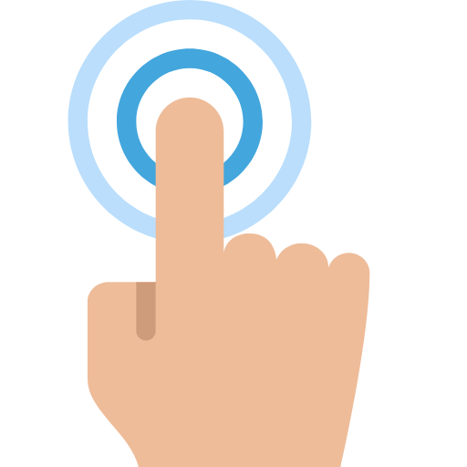

<div align="center">
  <a href="https://github.com/tomma5o/touchmyripple">
    
  </a>
  <br>
  <h1>TouchMyRipple</h1>
  <p>
    <em>touchMyRipple is a simple library that integrate ripple effect in your fantastic site!</em>
  </p>
  <p>
    <a href="https://github.com/tomma5o/touchmyripple/commits/master">
      
    </a>
    
  </p>
  <br>
  <a href="https://tomma5o.github.io/touchMyRipple/#line3"><b>Demo and Docs</b></a>
</div>

## Installation
 
[**Download Build**](https://raw.githubusercontent.com/tomma5o/touchMyRipple/master/dist/touchMyRipple.js)

```html
<script src="myDirectory/touchMyRipple.js"></script>
```
or
```javascript
npm install touchmyripple --save
```

## Basic Usage

`index.js`
```javascript
import tmripple from 'touchmyripple';

tmripple.init({
    color: '#bada55', // default is 'rgba(255, 255, 255, 0.4)'
    eventListener: 'touchstart' // default is 'click'
});

tmripple.attachToSelectors({
    selectors: '#foo .bar [type=button]',
    color: 'rgba(0, 0, 0, 0.4)',
    eventListener: 'mousedown'
});
```

## Methods

### **init(settings[Object])**

This method enables ripple effect to all the elements that have the attribute _data-animation="ripple"_.<br>
_All the following options are optional_


`settings[Object]`
```javascript
{
    // area is an option to make data-animation more specific
    area: 'class, id',

    // color...🤔 
    color: 'rgba, hex, hsla', 

    // pass the scrolling element if it's not window
    offsetEl: 'class, id',

    // this option accept an event listener 
    eventListener: 'event'
}
```

### **attachToSelectors(settings[Object])**

This method enables ripple effect to all the elements that match the class passed in 'selectors'

`settings[Object]`
```javascript
    {
        // selector of the element you want to attach the ripple ( is required )
        selectors: 'class, id',

        // color...🤔🤔🤔🤔🤔🤔
        color: 'rgba, hex, hsla',

        // pass the scrolling element if it's not window
        offsetEl: 'class, id',

        // this option accept an event listener 
        eventListener: 'event'
    }
```
## React Usage

`button.jsx`
```jsx
import tmripple from 'touchmyripple/react';

class Button extends Component {
  render() {
    return (
      <button {...this.props}>
        Hello <span>World</span>
      </button>
    );
  }
}

export default withRipple(Button);
```

`app.js`
```jsx
class App extends React.Component {
  render() {
    const settingObj = {
      eventName: "click", 
      color: "red"
    }

    return  <Button tmripple={settingObj} />
    // or
    // return  <Button tmripple />
  }
}
```

`settings[Object]`
```javascript
    {
        // default is "rgba(255,255,255,0.5)"
        color: 'rgba, hex, hsla',
        // this option accept an event listener for
        // differentiate smartphone event form desktop events
        // default is "click"
        eventListener: 'event'  
    }
```